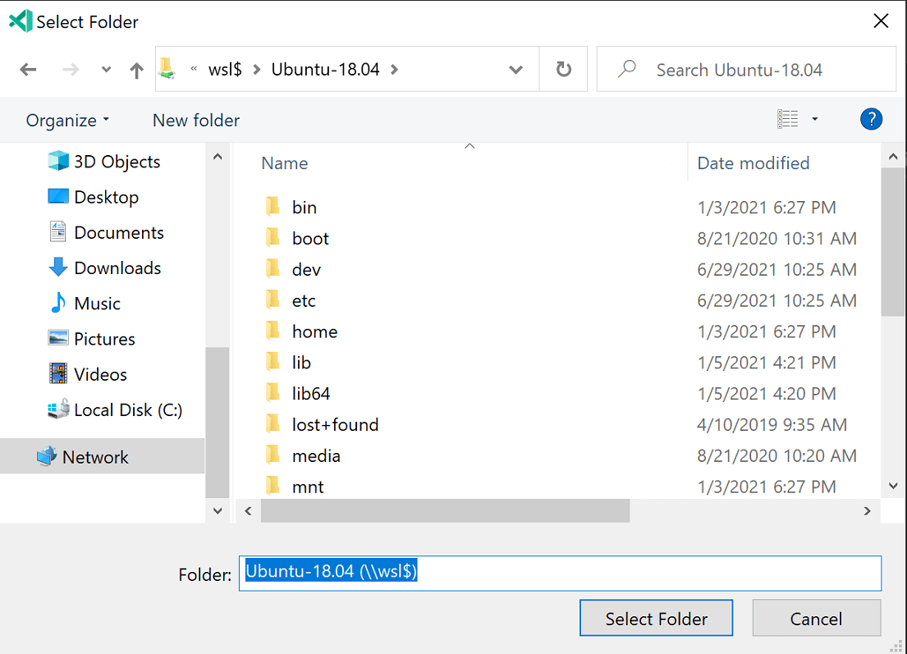

# Have a project? Open it in WSL

You'll want to use Remote - WSL for your Linux-based apps since you get a local-quality dev experience, such as full IntelliSense (completions), code navigation, and debugging.

[Open Folder in WSL](command:remote-wsl.openFolder) opens an explorer so that you can pick an app from the Linux file system:

You can also reopen a project in WSL that's located in the Windows file system  through **Remote - WSL: Reopen in WSL.**